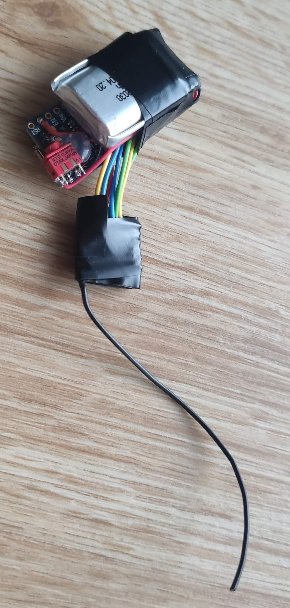

# ble_fanet_sender
## Quick & dirty: retrofit your BLE capable vario with FANET*  
A NRF52840 receiving the GPS data from your vario using bluetooth LE and send FANET livetracking data with a SX12xx LoRa module.

*(sending only, quick & dirty fixed 5sec interval)

A short, one evening project using Adafruit ItsyBitsy NRF52840 and SX1276 based LoRa radio module.    
BLE service & characteristis fits Ultrabip variometer    
If your phone is already connected to the veriometer blocking an other device, the NRF52840 can act as a "relay". Not working perfectly yet, (debugging in XCTrack is almost not possible...).

# Issues:
- BLE MAC and BLE service of vario is kind of hardcoded
- BLE data forwarding (eg. to XCTrack) basically works, but on high data rates it starts lagging. Needs advertisement parameter tuning.
- Fixed 5s send interval, no reduction on crowded areas/counting neighbors

## Resources: 
- https://github.com/adafruit/Adafruit_nRF52_Arduino
- https://github.com/gereic/GXAirCom
